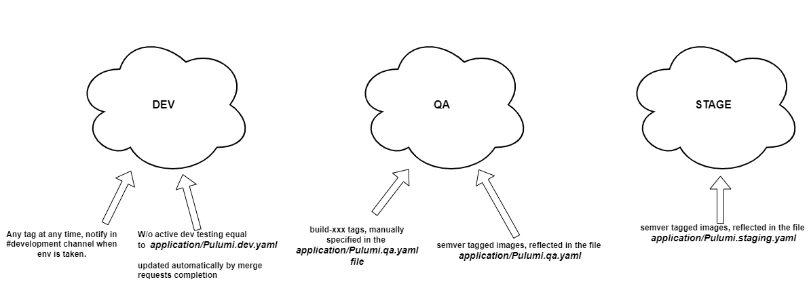

### Authorization:

- User identitication is managed by the digital signatures. 
- All gambling organizers are signing inbound data packages with their private key. 
- For other operations, user undergo login procedure. Once done, server issue a 1day-valid JWT token. 
 

### HA:
- Application is hosted using the `nomad` as cluster supervisor. Current implementation run on a fixed amount of client nodes (but not less than 4). For the HA we need to have approximately 30% more resources dedicated than target configuration to survive the death of a single node. In order to run nomad in high-available mode there should be at least 4 server nodes as well. 

### In-cluster communications:
- Conducted exclusively through rabbitMQ with RPC for request/response mechanics. This takes internal traffic load balancing out of equasion and simplify error handling.
- For HA we're using quorum queues with each application being connected to many of rabbit instances at once:
 

### Database:
- Using PostgreSQL with CitusDB extension, which accounts for:
- Reduction in consumed space due to columnar data storage type
- Effective access of time-series data
- Time-series data immutability
- Partitioning - for effective archivation of legacy data
- Ability to utilize standard postgreSQL for databases where exotic features are not needed - hence less entropy in project.
- Data sharding, helpth with storing data on block storage in majority of the hostings (expected total in 3 years is around 120TB of data). Also allows horizontal scaling which reduces price of high availability.
 

### Binary Data Storage:
- application expects an s3 compatible data storage.
- existing infrastructure provision it using `minio` software within the application cluster. See task definition `deployment:application/jobs/resource-minio.hcl`.
- HA is ensured by +-40% redundant space allocated

### Networking:

- Dedicated clusters for application and monitoring.
- Access to server nodes of both clusters is restricted by IP of the jumphost. Jumphost access on ssh port only.
- Access to application nodes of application cluster is not possible through public interface. Load balancer route requests on specific ports to the `fabio` (See task definition `deployment:infrastructure/files/fabio-load-balancer.hcl`.), which is looking into `consul` to resolve ip/port of individual allocation (service)

### Secrets management and security:
- Secrets are stored in the vault.
- All tasks, launched by nomad, are consuming secrets from vault.
- Secrets provisioning is happening on infrastructure provisioning by pulumi. Check detailed info in  `deployment:application/SECRETS_MANAGEMENT.md`. For sensitive workloads values must be set manually after provisioning.
- Using self-signed certificate for in cluster communications with nomad/consul (see  `deployment:shared/tls`).
- Wildcard public certificate is installed in fabio

### Monitoring:
- Service applications are writing logs to stdout so they are picked up by docker.
- Each of the nodes have an instance of `vector` application installed, which is reading docker logs and sending it to `loki`, hosted in monitoring cluster.
- Service applications are exposing their metrics on the port, different from the regular webserver(if any).
- Metrics are read periodically by `grafana-agent` and pushed to the prometheus-compatible storage `mimir`, hosted within the monitoring cluster.
- Third-party software (postgers, rabbit, redis etc.) have a specific exporters, launched within the same nomad task groups. This ensure metrics exposure and logs sending to stdout.

### CI/CD
- Both application infrastructure and application services themselves are provisioned using `pulumi` with stacks stored in pulumi cloud.
- There are two pulumi stacks: `application` and `infrastructure`, both have a dedicated root level folder in `deployment` repository.
- Withing each of those, there is a file `Pulumu.{{env}}.yaml` reflecting actual state of the environment following **Infrastructure as a Code** concept.

#### Application stack
- Designed the way, it can be applied within the any already provisioned nomad cluster. Desregards if this cluster was provisioned by `infrastructure` stack or in any other way.
- `pulumi up` of the application stack effectively means scheduling of the set of tasks in the nomad cluster. Files `application/Pulumu.{{env}}.yaml` are
reflecting the complete set of tasks, supposed to be run in nomad. Their versions and dedicated resources. CI in the project organized the way, this file gets updated with new build tags and update is followed up by `pulumi up`. 
- Image below reflects the common CI procedure - automated tags replacement and pulumi re-application for `dev` and manual tags creation/update on stable environments. 

- Build triggers, new versions commit (for automated updates), pulumi re-application is triggered by gitlab pipeline.

#### Infrastructure stack
- Creates the needed nomad clusters and all networking harness in AWS including:
- VPC
- subnets
- routing tables
- internet and nat gateways
- EC2 instances (server, client, jumphost)
- IAM roles
- Security groups
- load balancers
- S3 buckets (not used by application, but required for infra provisioning)
- Cloudflare DNS records
Detailed description of "what" and "how" is given within the `deployment:infrastructure/readme.md` file.