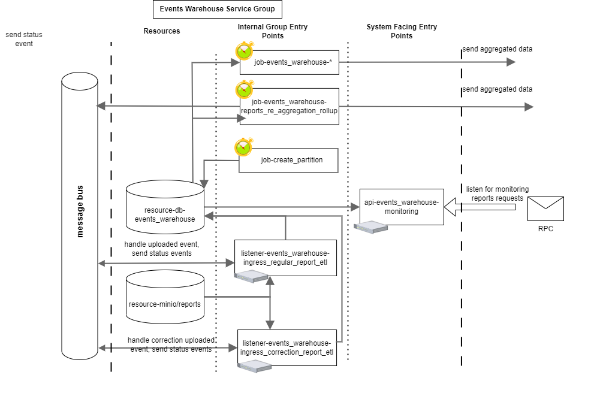
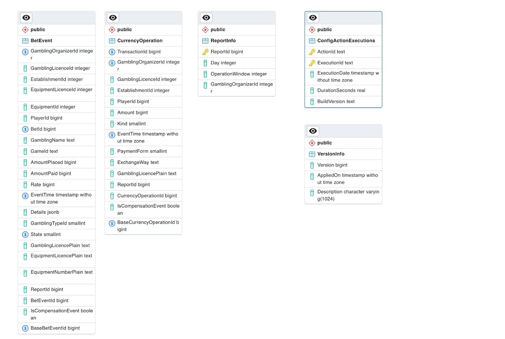

### Code location:
`reportetl:src/services/EventWarehouse`

### Components
 

#### DB

Tables `BetEvents` and `CurrencyOperations` are columnar tables. They are sharded (per gambling organizer - to control over performance) and particioned (by month - to drop the data once it's no longer required for compliance purposes).