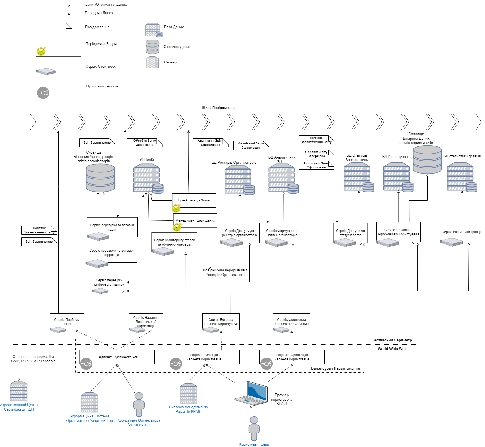
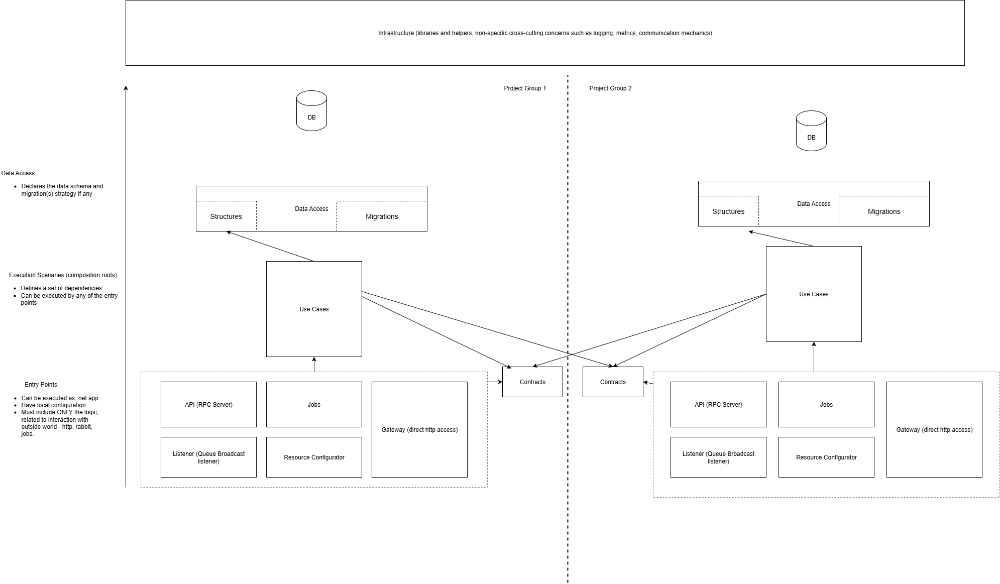

### Main flow diagram

Diagram above illustrates the regular report processing pipeline end to end. Starting from report receival from gambling organizer till aggregated summary reports review by system users.

It worth to mention that endpoints, exposed to public, aggregate multiple http servers (gateways in our terminology) for the purpose of independent scaling.

- registries management is fully covered by `GamblingRegistry.Gateway`
- gambling organizer API is composed of `IngressReportUpload.Gateway` (high load) and `GamblingOrganizer.Gateway` (simple data access). 

### Container Architecture

Application is built as a monorepo `reportetl` (with some exceptions described below).
Application is logically split by "service groups".

Each of the service groups is represented a set of projects.

Service groups are commonly aggregated under the single folder. But they don't have to in case service group is built of 1 or 2 projects. In this case project might be created in the root code folder.
See shorte details about each service group within the dedicated folder.

Image above illustrate service group components (all optional) and dependency graph between 2 of them.

Service group components are f# projects of following types:
- **Contracts**. Class libraray. Define the types-contracts of current service group, to be consumed by other service groups mostly through `API` and events broadcasting.
- **DataAccess**. Class library. Define the types reflecting db structures and data migrations. Each service group can own at most one database.
- **UseCases**. Class library. Each use case is a type with the single `execute` method. Supposed to be executed from different entry points (executables). _note: See `IUserCase` and related codebase_.
- **Jobs**. Short-living executable. Executes by schedule as a nomad task.
- **API**.  Long-living executable. Hosted as nomad task. RPC clients (all internal communications in application are made via RPC over rabbit). Each RPC call is described by `RemotelyInvokable`. Each `API` hosts the set of use cases, serving specific calls. _note: see `AddUseCaseRpcServer` and related codebase_
- **Listener**.  Long-living executable. Hosted as nomad task. Hosts a handlers for specific events broadcasted through rabbit. _note: see `AddUseCaseBroadcastListenerHandler` and related codebase_
- **Resource Configurator**.  Short-living executable. Executed as a separate task within the task group of other executable of same service group. Execution of this task blocks other tasks from being active. Contains a set of configuration actions, supposed to be executed to prepare service group operation. It is mostly a DB migrations execution. See _note: see `AddResourceConfigurationAction` and related codebase_
- **Gateway**. Long-living executable. Hosted as nomad task. Http server.

### Commonly used software:
- RabbitMQ v3.11
- CitusDB v11.1 over the Postgres 15.1 + HLL3.11 extension.
- F# 7 
- Redis:latest (technically 7.0.1). Although it is barely used now and is likely to be removed

Difference/deviations are explicitely listed in subfolders (if any)