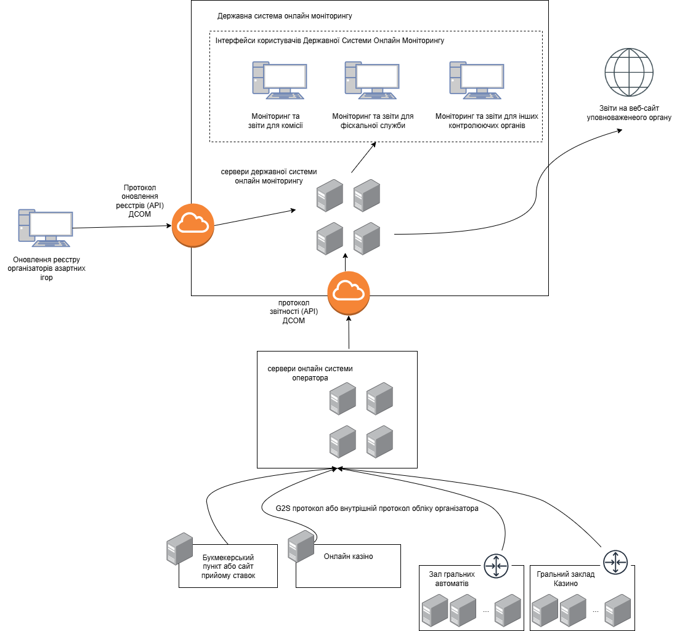

# Context diagram

Public APIs are described in form of openapi collections:
- [gambling_organizer.json](gambling_organizer.json) - organizer-facing API. All communications happens using organizer's digital signatures made with key, matching the taxpayer identifier registered in system.
- [registries.json](registries.json) - registry management API, system users only.

### Main implemented NFRs and challenges:
- Consume 1billion events per day
- Ready for both cloud and on-premise storages
- 10s response time for monitoring requests
- 2s response time for analytical requests
- Store data for 3 years (at the optimal pricing)
- HA (automatic recovery in under 20s in case of single cluster node failure).
